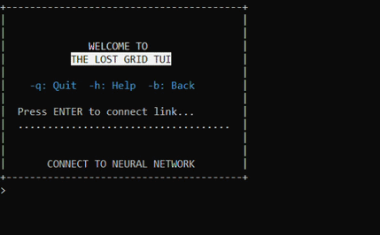

# PixelTerminalUI

[English](README.md) | [Русский](README.ru.md)


**Stateless UI-движок** на базе архитектуры **Backend-Driven UI (BDUI)** для текстовых терминалов (TUI) на .NET 8.

Фреймворк преобразует декларативные древовидные структуры экранных форм в плоские матрицы пикселей, полностью абстрагируя бизнес-логику от транспортного слоя. Это позволяет транслировать интерфейс через любой протокол (JSON/HTTP, gRPC, TCP-сокеты) на тонкие клиенты (ТСД, консоли, кастомные мобильные приложения), не удерживая состояние сессии в памяти сервера.

📖 **[Архитектурный Whitepaper: История эволюции движка от Stateful Telnet к Stateless BDUI](docs/evolution.ru.md)** — подробный разбор legacy-проблем, оптимизации Garbage Collector и низкоуровневой битовой упаковки кадра.

---

## ⚡ Ключевые особенности

* 🧵 **Полный Stateless:** Каждый запрос от клиента обрабатывается как изолированная атомарная транзакция. Сервер больше не удерживает в оперативной памяти тяжелые деревья открытых форм, их делегатов и сокетов между действиями пользователя.
* 📦 **Легковесные UI-компоненты:** Формы и контролы спроектированы на базе C# рекордов (`record`). Они хранят состояние экрана, эффективно переиспользуются для мутабельных изменений без лишних аллокаций в куче и при этом идеально сериализуются во внешние хранилища.
* ⏳ **Асинхронные Команды:** Логика переходов и бизнес-валидация инкапсулированы в независимые команды `ICommand` на базе `ValueTask`. Это обеспечивает ультимативную отзывчивость при интеграции с базами данных, внешними API и сетевыми ресурсами.
* 💾 **Сохранение цепочки процессов:** Движок из коробки поддерживает прозрачное сохранение и восстановление шагов выполнения (точек останова) конечного автомата команд во внешнюю СУБД (In-memory/Redis) на любом свободном узле кластера.

---

## 🚀 Быстрый старт (Quick Start)

### 1. Опишите форму и команду

Интерфейсы в `PixelTerminalUI` описываются декларативно через пассивные рекорды данных, а переходы привязываются к изолированным командам:

```csharp
// Изолированная команда для обработки навигации
public sealed class StartGameCommand : Command<OneStepCommandState>
{
    public override OneStepCommandState State { get; set; } = OneStepCommandState.Initial;
    public override Guid Id { get; } = Guid.NewGuid();
    public override Guid ControlId { get; set; }

    public override async ValueTask<bool> ExecuteAsync(ICommandContext context)
    {
        // Логика перехода на следующую форму
        var nextScreen = new GamePlayScreen { Id = Guid.NewGuid(), SessionId = context.SessionId };
        await context.SessionRepository.SaveActiveScreenAsync(context.SessionId, nextScreen);
        return true;
    }
}

// Декларативное описание стартового экрана
public sealed record WelcomeScreen : TerminalScreen
{
    public WelcomeScreen()
    {
        Name = "WelcomeScreen";
        Width = 40;
        Height = 10;
        
        var inputId = Guid.NewGuid();
        Widgets = new List<TextWidget>
        {
            new TextWidget { Left = 2, Top = 2, Value = "WELCOME TO THE GRID" },
            new TextEntryWidget 
            { 
                Id = inputId,
                Left = 2, Top = 5, Width = 10,
                Hint = "PRESS ENTER TO START",
                Command = new StartGameCommand { ControlId = inputId }
            }
        };
        FocusedEntryWidgetId = inputId;
    }
}
```

### 2. Зарегистрируйте компоненты в DI-контейнере

Фреймворк предоставляет удобный Fluent API для подключения ядра рендеринга и высокопроизводительного распределенного репозитория сессий на базе **Redis**:

```csharp
var builder = WebApplication.CreateBuilder(args);

// Инициализация ядра PixelTerminalUI и регистрация стартового экрана
builder.Services.AddPixelTerminalUI();
builder.Services.AddPixelTerminalStartup<WelcomeScreen>();

// Подключение целевого распределенного хранилища состояний на базе Redis Hash
builder.Services
    .AddTerminalRedisRepository("localhost:6379,abortConnect=false")
    .WithSessionTimeout(TimeSpan.FromHours(24))
    .RegisterCustomScreens(custom => custom
        // Регистрация кастомных полиморфных экранов, команд и виджетов вашего приложения
        .RegisterScreen<WelcomeScreen>()
        .RegisterScreen<GamePlayScreen>()
        .RegisterCommand<StartGameCommand>());
```

---

## 🕹️ Демонстрационное приложение

Чтобы увидеть фреймворк в действии, вы можете запустить **The Lost Grid** — текстовую демонстрационную игру, написанную для демонстрации возможностей `PixelTerminalUI`.



* 📖 [Подробный разбор архитектуры игры и механики геймплея](docs/demo-game.ru.md)
* 🖥️ **Серверная часть (API):** `examples/TheLostGrid.Server` — логика экранов, команд и валидаторов.
* 📟 **Клиентская часть (TUI):** `examples/TheLostGrid.Client` — тонкий консольный тонкий клиент для отрисовки кадров.

> ℹ️ **Сетевой цикл:** Ввод осуществляется на основе транзакций. Клиент отправляет только один сетевой запрос, когда пользователь нажимает клавишу `Enter`, вместо потоковой передачи каждого нажатия клавиши.

### 🐳 Запуск в Docker

Вы можете развернуть готовую демонстрационную игру и всю необходимую инфраструктуру одной командой. Фреймворк автоматически поднимет сервер ядра движка, высокопроизводительный распределенный кэш Redis и удобную веб-панель управления:

```bash
# 1. Запустить сервер ядра и кэш Redis одной командой в фоне
docker compose up -d --build

# 2. Подключиться с помощью тонкого TUI-клиента прямо внутри консоли сервера
docker exec -it pixel_terminal_app env PIXEL_TERMINAL_SERVER_URL=http://localhost:8080 TERM=xterm-256color dotnet /app/client/TheLostGrid.Client.dll
```

После успешного развертывания контейнеров вам станут доступны следующие локальные точки:
* 📟 **Swagger API сервера:** `http://localhost:5221/swagger` — для ручной отправки команд и проверки генерации BDUI-экранов.
* 🖥️ **Панель Redis Commander:** `http://localhost:8082` — для визуального анализа структуры полей внутри **Redis Hash** сессий в реальном времени.

---

## 🗺️ Roadmap проекта

Проект развивается как экспериментальная R&D песочница. Текущий статус реализации ключевых архитектурных узлов:

### ✅ Реализовано
- [x] **Double Buffering:** Хранение предыдущего кадра сессии на сервере для вычисления дельты изменений и отправки клиенту только изменившихся пикселей.
- [x] **Бинарный протокол (Bit Packing):** Упаковка символа, цветов `ConsoleColor` и инверсии пикселя в один 4-байтовый `uint` через побитовые сдвиги (сокращение сетевого оверхеда).
- [x] **Redis Hash Persistence:** Миграция горячего UI-стейта и кадровых буферов с MongoDB на атомарные поля Redis Hash для снижения аллокаций памяти ([Issue #2](https://github.com/alexeysp11/pixel-terminal-ui/issues/2)).

### ⏳ В процессе разработки & Бэклог
- [ ] **Инлайновый ввод и серверное управление фокусом**: Реализация маппинга координат активного инпута на стороне сервера. Это позволит отрисовывать курсор ввода (`_`) прямо внутри сгенерированной пиксельной матрицы, избавив пользователя от необходимости вводить команды в отдельной строке под формой ([Issue #1](https://github.com/alexeysp11/pixel-terminal-ui/issues/1)).
- [ ] **Observability Extension:** Интеграция легковесного агента OpenTelemetry (OTLP) для автоматического сбора метрик Kestrel и трейсинга цепочек выполнения команд без раздувания кодовой базы.
