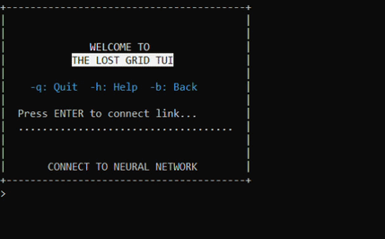

# 🎮 Demo Game: The Lost Grid (Architecture Overview)

[English](demo-game.md) | [Русский](demo-game.ru.md)

**The Lost Grid** — это текстовая игра, созданная исключительно для демонстрации возможностей рендеринга и работы фреймворка `PixelTerminalUI` в рамках Backend-Driven подхода.

### 👥 Игровой процесс
В игре доступны два класса персонажей, определяющие механику взаимодействия с миром:
* **Хакер (Hacker)** — специализируется на взломе терминалов и сетевых узлов.
* **Риггер (Rigger)** — управляет дронами для сканирования и исследования окружающей местности.

---

### ⌨️ Интерфейс и управление терминалом

Интерфейс игры спроектирован в стиле классических TUI-систем:



* **Навигационные команды:** Игрок перемещается по текстовым меню, отправляя управляющие символы.
* **Горячие клавиши:** Быстрый выход (`-q: Quit`), вызов справки по доступным действиям в комнате (`-h: Help`) или шаг назад (`-b: Back`).
* **Ввод данных:** Символы, которые вводит пользователь, не отправляются на сервер по одному. Клиентское приложение собирает строку локально и отправляет её на бэкенд только по нажатию клавиши `Enter`.

---

### ⚙️ Как это устроено под капотом

Проект разделен на две изолированные части, которые общаются по сети:

1. **Клиент (`TheLostGrid.Client`)** — «тупой» терминал. Он не содержит игровой логики, текстов квестов или правил. Его задача: считать строку ввода, отправить её на сервер по нажатию `Enter` и отрисовать полученную от сервера матрицу пикселей.
2. **Сервер (`TheLostGrid.Server`)** — обрабатывает игровой процесс в Stateless-режиме:
   * Принимает команду от клиента.
   * Загружает текущее состояние игрока (сессию) из распределенного кэша (Redis).
   * Выполняет бизнес-логику шага.
   * Генерирует дерево компонентов для нового экрана, переводит его в плоскую матрицу и отдаёт клиенту.
   * Сразу после этого освобождает память (стейт не держится в RAM бэкенда).

---

### 🏗️ Реализация команд и экранов

Игровой процесс разбит на изолированные обработчики команд (`Command`) и декларативные экраны интерфейса (`TerminalScreen`). Состояние шага шаринга описывается перечислением (например, `OneStepCommandState`).

Ниже — настоящий код из `examples/TheLostGrid.Server/Scenarios/Welcome/` (в описании экрана для краткости показаны не все виджеты — полный список из 5 элементов смотрите в исходном файле `WelcomeScreen.cs`):

#### 1. Изолированная команда для обработки навигации
```csharp
public sealed class WelcomeStartGameCommand : Command<OneStepCommandState>
{
    public override OneStepCommandState State { get; set; } = OneStepCommandState.Initial;
    public override Guid Id { get; } = Guid.NewGuid();
    public override Guid WidgetId { get; set; }

    public override async ValueTask<bool> ExecuteAsync(ICommandContext context)
    {
        // Переход к экрану создания персонажа
        CharacterCreationScreen nextScreen = new()
        {
            Id = Guid.NewGuid(),
            Name = nameof(CharacterCreationScreen),
            SessionId = context.SessionId,
            ParentScreenId = context.Screen.Id
        };

        await context.SessionRepository.SaveActiveScreenAsync(context.SessionId, nextScreen);
        return true;
    }
}
```

#### 2. Декларативное описание стартового экрана (сокращённая версия)
```csharp
public sealed record WelcomeScreen : TerminalScreen
{
    public WelcomeScreen()
    {
        Name = "WelcomeScreen";
        Width = 40;
        Height = 12;

        TextWidget titleLabel = new()
        {
            Id = Guid.NewGuid(),
            Name = "TitleLabel",
            Left = 11, Top = 3, Width = 17,
            Value = "THE LOST GRID TUI",
            Visible = true,
            Inverted = true
        };

        WelcomeStartGameCommand connectionCommand = new();

        TextEntryWidget hiddenInput = new()
        {
            Id = Guid.NewGuid(),
            Name = "ConnectionTriggerInput",
            Left = 2, Top = 8, Width = 36,
            Required = false,
            Hint = "CONNECT TO NEURAL NETWORK",
            Visible = true,
            Command = connectionCommand,
            Value = string.Empty
        };

        // Явно связываем команду с виджетом, который её запускает
        connectionCommand.WidgetId = hiddenInput.Id;

        Widgets = [titleLabel, hiddenInput];
        FocusedEntryWidgetId = hiddenInput.Id;
    }
}
```
